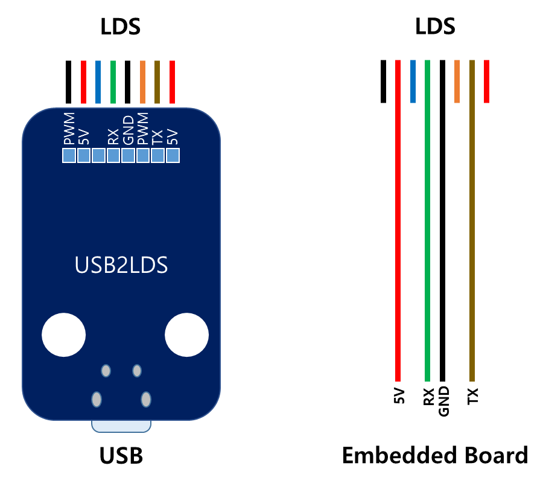

# LDS-01 Lidar

360 Laser Distance Sensor LDS-01 is a 2D laser scanner capable of sensing 360 degrees that collects a set of data around the robot to use for SLAM (Simultaneous Localization and Mapping) and Navigation.

# Specs

|Items	Specifications
|--------------------------|------------------------------------|
| Operating supply voltage |                          5V DC ±5% |
| Light source             | Semiconductor Laser Diode(λ=785nm) |
| LASER safety             |                 IEC60825-1 Class 1 |
| Current consumption      |    400mA or less (Rush current 1A) |
| Detection distance       |                    120mm - 3,500mm |
| Interface                | 3.3V USART (230,400 bps) 42bytes per 6 degrees, Full Duplex option |
| Ambient Light Resistance | 10,000 lux or less |
| Sampling Rate            | 1.8kHz |
| Dimensions               | 69.5(W) X 95.5(D) X 39.5(H)mm |
| Mass                     | Under 125g |

| Items                             | Specifications  |
|-----------------------------------|-----------------|
|Distance Range	                    |   120 - 3,500mm |
|Distance Accuracy (120mm - 499mm)  |     ±15mm       |
|Distance Accuracy(500mm - 3,500mm) |     ±5.0%       |
|Distance Precision(120mm - 499mm)  |     ±10mm       |
|Distance Precision(500mm - 3,500mm)|     ±3.5%       |
|Scan Rate | 300±10 rpm |
|Angular Range | 360 deg |
|Angular Resolution | 1 deg |

# Connection

[Connector for LDS Molex 51021-0800](http://www.molex.com/pdm_docs/sd/510210800_sd.pdf)
[Connector for USB2LDS Molex 53048-0810](http://www.molex.com/pdm_docs/sd/530480810_sd.pdf)

