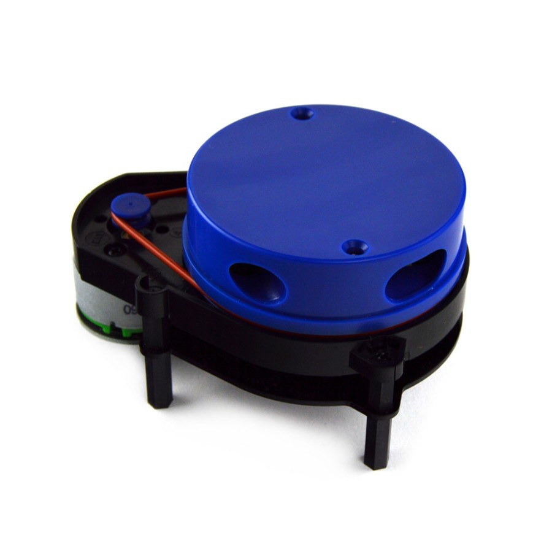
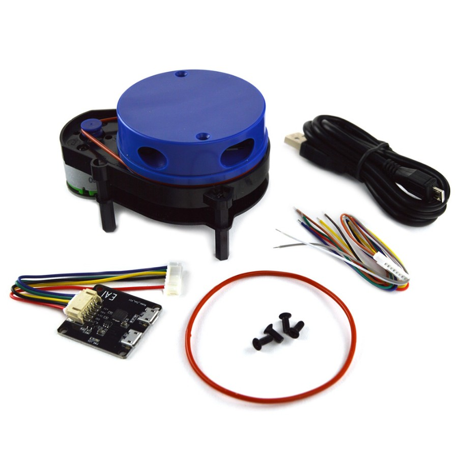

# YDLidar X4

- [git repo](https://github.com/EAIBOT/ydlidar)

## Specs

- 5kHz sampling rates
- 360 degrees, adapable scanning frequency from 6Hz to 12Hz
- 0.12 - 10 m range
- Lidar height 101.7 x 61 x 51.8mm (LxWxH)
- Power: 5V with 450 mA in rush current, 350 mA running current
- Lidar UART, when not using USB adaptor board
    - buad rate 128000 8N1
    - 3.3V TTL

## Package

The lidar ships with:

- USB interface board
- Extra band
- USB cable
- Extra interface cable so you can add your own interface on the other end

